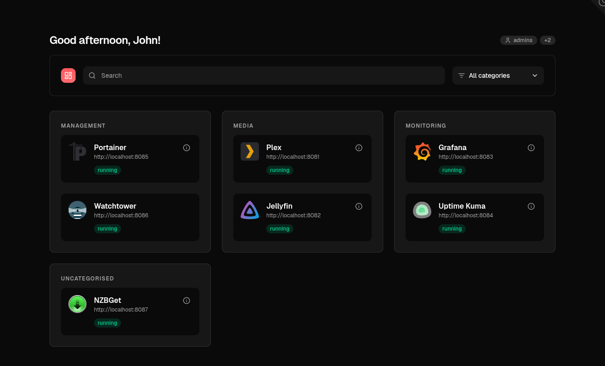

<div align="center">
  
  <h1>Dashmark</h1>
  <p>A lightweight dashboard of links to your Docker services.</p>
  <p>
    <a href="https://github.com/edmogeor/dashmark/actions/workflows/ci.yml">
      
    </a>
    <a href="https://github.com/fallow-rs/fallow">
      
    </a>
    <a href="./LICENSE">
      
    </a>
  </p>
</div>

Dashmark reads your Docker daemon and shows a link for each labeled container automatically. Shape those links with `dashmark.*` labels on your containers - set the title, icon, category, and more. No Docker SDK. No agent. Just a single small Node.js service that reads container labels and renders a clean, minimal dashboard with Astro.



<!-- toc -->

- [Features](#features)
- [Quick start](#quick-start)
- [How it works](#how-it-works)
- [Configuration](#configuration)
  - [Environment variables](#environment-variables)
  - [Docker labels](#docker-labels)
  - [YAML config file](#yaml-config-file)
  - [Icons](#icons)
  - [Access groups](#access-groups)
- [Security](#security)
- [Development](#development)
- [License](#license)

<!-- tocstop -->

## Features

- **Label-driven.** Dashmark lists your containers and makes a card for each one whose URL it can find from a `dashmark.url` label, a Traefik rule, or YAML.
- **Label everything.** Set titles, icons, categories, and more with `dashmark.*` labels on your containers.
- **Traefik friendly.** Reuse your existing Traefik router rules as card URLs, so you do not set a URL twice.
- **Group with categories.** Cards group under labels like `Media` or `Monitoring`.
- **Search and filter.** Find a service by name, category, or a custom alias.
- **Live status.** Each card shows whether its container is running and healthy. Status refreshes every 30 seconds.
- **Custom icons.** Name a selfhst reference, link to an image, or point at a file in your icons directory.
- **Automatic icons.** With no icon set, Dashmark fuzzy-matches the image name against the [selfhst](https://selfh.st/) index.
- **Access groups.** Hide cards from users who should not see them, using groups from Authentik or Authelia.
- **YAML config.** Define cards by hand for services Docker does not run.
- **Self-hosted and small.** One container, one read-only socket mount, no external database.

## Quick start

Dashmark ships as a Docker image. The easiest way to run it is with Docker Compose.

Create a `docker-compose.yml`:

```yaml
services:
  dashmark:
    image: ghcr.io/edmogeor/dashmark:latest
    container_name: dashmark
    ports:
      - "127.0.0.1:4321:4321"
    volumes:
      - ./config.yml:/app/config.yml:ro
      - ./icons:/app/icons:ro
    environment:
      - ACCESS_GROUPS_ENABLED=false
      - DOCKER_HOST=tcp://dockerproxy:2375
    depends_on:
      - dockerproxy
    restart: unless-stopped

  dockerproxy:
    image: wollomatic/socket-proxy:1
    container_name: dashmark-dockerproxy
    restart: unless-stopped
    read_only: true
    cap_drop:
      - ALL
    security_opt:
      - no-new-privileges
    command:
      - "-loglevel=info"
      - "-listenip=0.0.0.0"
      - "-allowfrom=dashmark"
      - "-allowGET=/version"
      - "-allowGET=/v1\\..{1,2}/containers/.*"
    volumes:
      - /var/run/docker.sock:/var/run/docker.sock:ro
```

Then start it:

```bash
docker compose up -d
```

Open http://localhost:4321. Dashmark shows a card for every running container that has a URL.

## How it works

Here are the words we use, in plain terms:

- **Card** is one clickable entry on the dashboard. It links to a service. Most cards come from a Docker container.
- **Container** is a Docker container Dashmark found through the Docker API.
- **Category** is a label that groups cards, like `Media` or `Monitoring`.
- **Access groups** are the permission groups from your identity provider. They decide who sees a card.
- **Container state** is what Docker reports, like `running` or `paused`.
- **Health status** is the optional health-check result: `healthy`, `unhealthy`, or `starting`.
- **Icon** is the picture on a card. It can be an image, initials, or a simple box.

On each page load, Dashmark asks Docker for its containers. It turns each one into a card. The page then polls for status every 30 seconds to keep badges fresh.

Dashmark reads Docker directly over HTTP. It never installs an agent and never writes to your socket. Mount the socket read-only.

## Configuration

You can configure Dashmark with environment variables, Docker labels, or a YAML file. Labels live on your containers. The YAML file lives on the Dashmark host. YAML wins when both set the same value.

### Environment variables

| Variable | Default | What it does |
| --- | --- | --- |
| `DOCKER_HOST` | `unix:///var/run/docker.sock` | Docker socket or TCP endpoint |
| `DASHMARK_LABEL_PREFIX` | `dashmark` | Prefix for all Dashmark labels |
| `CONFIG_FILE` | `/app/config.yml` | Optional YAML config file path |
| `ICONS_DIR` | `/app/icons` | Folder for custom icon files |
| `ICONS_CDN` | `https://cdn.jsdelivr.net/gh/selfhst/icons@main` | Base URL for the selfhst icon CDN |
| `ACCESS_GROUPS_ENABLED` | `false` | When `true`, filter cards by the groups header |
| `ACCESS_GROUPS_HEADER` | `auto` | Group header. `auto` tries `X-Authentik-Groups`, then `Remote-Groups` |
| `DISABLE_SEARCH` | `false` | Hide the search bar and category filter |
| `DISABLE_STATUS` | `false` | Hide the state and health badge on cards |
| `DISABLE_AUTOMATIC_ICONS` | `false` | When `true`, do not auto-match icons. Cards without an icon show initials |
| `PORT` | `4321` | HTTP port Dashmark listens on |

### Docker labels

Put labels on your containers to shape their cards. Every label starts with the prefix, which is `dashmark` by default.

| Label | What it does |
| --- | --- |
| `dashmark.hidden` | `"true"` hides the container completely |
| `dashmark.url` | The URL the card links to. You can also set this in YAML or reuse an existing Traefik rule |
| `dashmark.title` | The display title. Falls back to the container name |
| `dashmark.description` | A short description shown in a tooltip |
| `dashmark.icon` | A selfhst reference, a URL, a filename in `ICONS_DIR`, or `placeholder` |
| `dashmark.category` | The group name |
| `dashmark.access_groups` | Comma-separated group allow-list |
| `dashmark.search_aliases` | Comma-separated extra search terms |
| `dashmark.order` | Sort order within a category. Lower numbers come first |

Example:

```yaml
services:
  plex:
    image: plexinc/pms-docker
    labels:
      - "dashmark.title=Plex"
      - "dashmark.description=Media server"
      - "dashmark.url=https://plex.example.com"
      - "dashmark.icon=plex"
      - "dashmark.category=Media"
      - "dashmark.order=1"
```

If you do not set `dashmark.url`, Dashmark tries to build one from a Traefik label that looks like `traefik.http.routers.<name>.rule` with a `Host(...)` rule. It defaults to `https://`.

If you already route a service with Traefik, you do not need `dashmark.url` at all:

```yaml
services:
  plex:
    image: plexinc/pms-docker
    labels:
      - "traefik.enable=true"
      - "traefik.http.routers.plex.rule=Host(`plex.example.com`)"
      - "dashmark.title=Plex"
      - "dashmark.icon=plex"
      - "dashmark.category=Media"
```

Dashmark reads the Traefik router rule and links the card to `https://plex.example.com`.

After you change a container's labels, recreate it so Docker applies the new labels:

```bash
docker compose up -d
```

### YAML config file

The optional YAML file at `CONFIG_FILE` is keyed by container name. It lets you define cards by hand, or override labels for a container. YAML values beat Docker labels for the same container.

```yaml
services:
  plex:
    title: Plex
    description: Media server
    url: https://plex.example.com
    icon: plex
    category: Media
    order: 1
    search_aliases:
      - movies
      - watch later
    access_groups:
      - media
      - admins

  nzbget:
    url: https://nzbget.example.com
    category: Downloads
    order: 2
```

Each service accepts these fields: `title`, `description`, `url`, `icon`, `category`, `order`, `hidden`, `access_groups`, and `search_aliases`.

### Icons

Dashmark resolves a card's icon in this order:

1. `icon: placeholder` shows the title's initials. Use this to opt a single container out of auto-matching.
2. An `http(s)` URL is used directly.
3. A filename is looked up inside `ICONS_DIR`. A missing file shows initials and stops there.
4. A selfhst reference is resolved against the CDN.
5. With no icon set, Dashmark fuzzy-matches the image name against the selfhst index.
6. If nothing matches, it falls back to initials.

The [selfhst](https://selfh.st/) index ships in the image. If it is missing, Dashmark pages it from the GitHub API instead.

### Access groups

Turn on `ACCESS_GROUPS_ENABLED=true` to filter cards by group. Your reverse proxy must send a groups header with each request. Dashmark shows a card when the card's `access_groups` overlap with the user's groups. Cards with no `access_groups` are visible to everyone.

Serve Dashmark behind a proxy that handles login, such as Authentik or Authelia, so the header is trustworthy. When the header is missing, Dashmark shows an error and sets the `Vary` header so shared caches key on the groups header.

## Security

If you host Dashmark on the public internet, add a login layer in front of it. We recommend Authentik or Authelia. Pair this with access groups to control who sees which cards.

Also expose Docker through a [socket proxy](https://github.com/wollomatic/socket-proxy) instead of mounting the raw socket. A socket proxy gives read-only, filtered access to the Docker API. It keeps the full Docker socket away from Dashmark and anything else that reaches the internet.

## Development

```bash
npm install        # install dependencies
npm run dev        # start the dev server against a mock Docker API
npm test           # run the tests (Vitest)
npm run typecheck  # type-check with astro check
npm run build      # build for production
```

`npm run dev` uses a mock Docker API with a handful of labeled cards. It needs no Docker daemon and gives you hot reload.

## License

MIT
