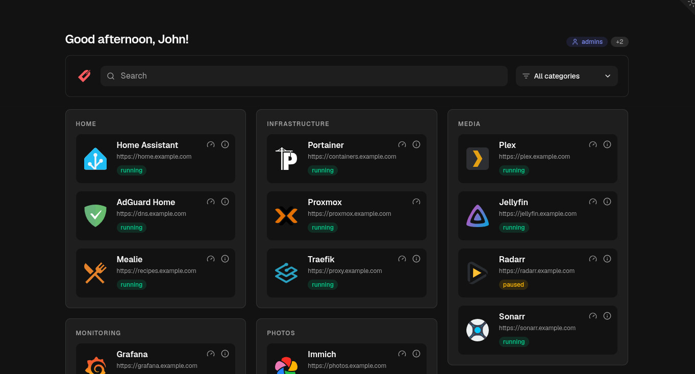

<div align="center">
  
  <h1>Dashmark</h1>
  <p>A lightweight dashboard for your Docker services.</p>
  <p>
    <a href="https://github.com/edmogeor/dashmark/actions/workflows/ci.yml">
      
    </a>
    <a href="https://github.com/edmogeor/dashmark/releases">
      
    </a>
    <a href="https://github.com/fallow-rs/fallow">
      
    </a>
    <a href="./LICENSE">
      
    </a>
  </p>
</div>

Dashmark finds Docker containers with `dashmark.*` labels and displays them as cards. It is a self-hosted Node.js service built with Astro.



<p align="center"><a href="https://edmogeor.github.io/dashmark/demo/">View the live demo</a> | <a href="https://edmogeor.github.io/dashmark/docs/">Read the documentation</a></p>

## Why Dashmark?

Excellent self-hosted dashboards already exist, including [Homepage](https://gethomepage.dev/), [Heimdall](https://heimdall.site/), [Homarr](https://homarr.dev/), and [Flame](https://github.com/pawelmalak/flame). Dashmark takes inspiration from Heimdall's simplicity, then removes the setup friction: configure cards beside their services in `docker-compose.yml`, let Docker labels supply the details, and rely on automatic icon matching when an explicit icon is not worth the effort.

Dashmark is links first. It is built for fast, low-fuss navigation across a large collection of services: searchable, easy to scan, and polished by default with [shadcn/ui](https://ui.shadcn.com/), without turning the dashboard itself into another project to maintain.

## Features

- Discover opt-in containers on one or more Docker hosts.
- Create cards from Docker labels or YAML.
- Reuse Traefik host rules for card links.
- Organise cards with categories, aliases, and custom ordering.
- Show container state, health, and resource metrics.
- Limit cards and metrics by groups from an authentication proxy.
- Use automatic, selfh.st, remote, local, or placeholder icons.

## Quick start

1. Create a `docker-compose.yml` with Dashmark and labels for the services you want to show:

   ```yaml
   services:
      dashmark:
        image: ghcr.io/edmogeor/dashmark:latest
        ports:
          - "127.0.0.1:4321:4321"
        volumes:
          - /var/run/docker.sock:/var/run/docker.sock:ro
          - ./data:/data
        restart: unless-stopped

      plex:
        image: plexinc/pms-docker
        labels:
          dashmark.url: https://plex.example.com
          dashmark.title: Plex
          dashmark.category: Media
   ```

2. Start Dashmark and your labeled services:

   ```bash
   docker compose up -d
   ```

This example uses Dashmark's default local Docker socket. For a production-ready setup with a restricted Docker socket proxy and its required `DOCKER_HOSTS` setting, use the [example `docker-compose.yml`](docker-compose.yml). For Docker CLI setup, reverse-proxy deployment, and detailed configuration, use the documentation.

## Documentation

[Read the documentation](https://edmogeor.github.io/dashmark/docs/) for quick-start guidance, Docker and YAML card configuration, dashboard settings, metrics, access control, and secure deployment.

## Development

```bash
npm install
npm run dev
npm run lint
npm test
npm run typecheck
npm run build
```

`npm run dev` uses a mock Docker API, sample cards, and sample authentication headers. It does not need Docker and supports hot reload. It simulates the `admins`, `media`, and `family` groups. For example, run `MOCK_USER_GROUPS=media STATUS_BADGE_ACCESS=admins npm run dev` to test a different user.

Contributions are welcome. Open an issue or pull request with a clear description of the change.

## Donations

If Dashmark is useful to you, you can support its development.

<a href="https://www.buymeacoffee.com/edmogeor" target="_blank"></a>

## Thanks

- [selfh.st/icons](https://github.com/selfhst/icons) for the bundled icon index under [CC-BY-4.0](https://creativecommons.org/licenses/by/4.0/).
- [Homepage](https://gethomepage.dev/) for reference implementations of provider metrics and API response shapes.

See [`THIRD_PARTY_NOTICES.md`](THIRD_PARTY_NOTICES.md) for shipped attribution details.

## License

[MIT](LICENSE)

## AI Disclaimer

AI tools assist development. The maintainer reviews and remains responsible for every change.
