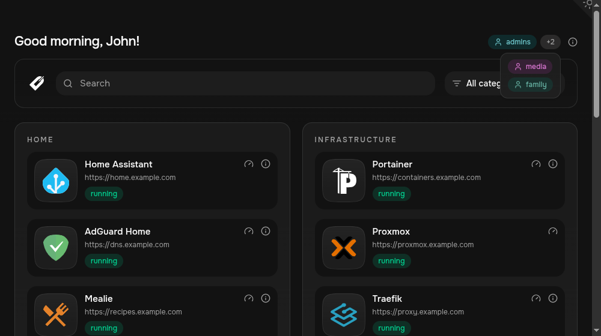

Dashmark expects your reverse proxy or authentication provider to set trusted identity headers. It does not authenticate users itself.

:::caution
Access control relies on a trusted reverse proxy or authentication provider to establish identity headers. Configure the proxy to remove or overwrite all client-supplied identity headers before forwarding requests to Dashmark.
:::



When enabled, Dashmark shows the authenticated user's matching groups as badges beside the greeting.

## 1. Enable filtering

```yaml
services:
  dashmark:
    environment:
      - ENABLE_ACCESS_CONTROL=true
      - ACCESS_GROUPS_HEADER=auto
```

`auto` checks headers used by Authentik, Authelia, oauth2-proxy, and Keycloak Gatekeeper. For another proxy, set the exact header name:

```yaml
environment:
  - ACCESS_GROUPS_HEADER=X-Forwarded-Groups
```

Your proxy must remove or overwrite any client-supplied identity headers before forwarding a request.

## Identity and group headers

`ACCESS_GROUPS_HEADER=auto` checks `X-Authentik-Groups`, `Remote-Groups`, `X-Auth-Request-Groups`, `X-Forwarded-Groups`, and `X-Auth-Groups` in that order. Group values may be comma-, semicolon-, or pipe-separated, or a JSON array of strings.

Set `USER_NAME_HEADER`, `USER_FIRST_NAME_HEADER`, `USER_LAST_NAME_HEADER`, `USER_USERNAME_HEADER`, and `USER_EMAIL_HEADER` to map your proxy's identity headers into greeting templates. Leave them at `auto` to use supported provider defaults.

When group-based access is required and the configured group header is missing, Dashmark shows a missing-groups-header error rather than exposing filtered cards.

## 2. Restrict a card

Set `dashmark.access` on the container, or `access` in its YAML service entry. Entries match groups, usernames, and email addresses without case sensitivity.

```yaml
labels:
  dashmark.url: https://portainer.example.com
  dashmark.access: admins,ops@example.com
```

Cards without access entries stay visible to everyone. Group values can be comma-, semicolon-, or pipe-separated, or a JSON string array.

## 3. Restrict status and metrics

These settings apply independently of card visibility:

```yaml
environment:
  - STATUS_BADGE_ACCESS=admins
  - METRICS_ACCESS=admins,operators
```

An unset value makes the feature visible to all users who can see the card.

## Optional direct-access token

For `AUTH_TOKEN` setup and reverse-proxy configuration, see [Deployment and security](/dashmark/docs/deployment/security/#direct-access-token).
