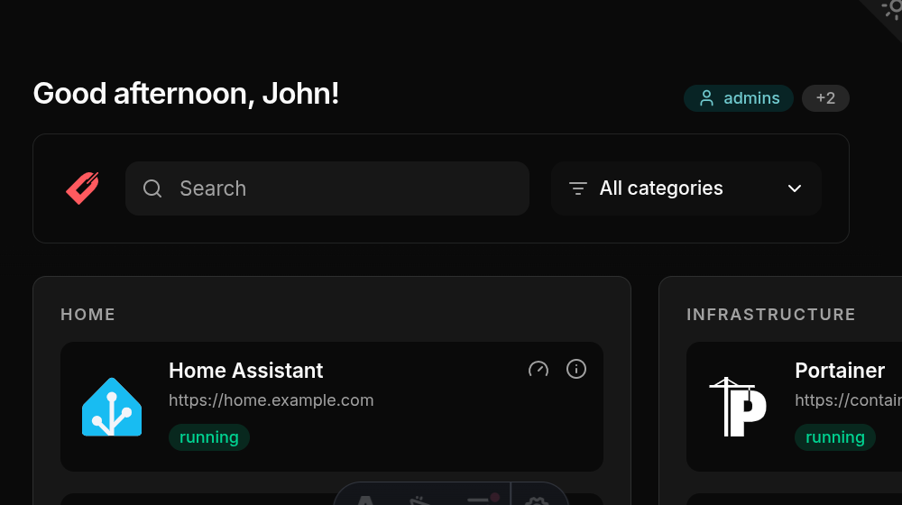

Set options with environment variables in Compose, or use their snake_case names in `config.yml` under `settings`. YAML takes precedence. `CONFIG_FILE` is the only environment-only option.

Before upgrading, review the [release notes](https://github.com/edmogeor/dashmark/releases) for breaking configuration changes.

```yaml
services:
  dashmark:
    environment:
      - SHOW_SEARCH=true
      - CATEGORY_ORDER=Media,Productivity,Home
      - METRICS_DATABASE_PATH=/data/metrics.db
```

```yaml
settings:
  show_search: true
  category_order: [Media, Productivity, Home]
  metrics_database_path: /data/metrics.db
```

## Docker and files

| Environment variable | Default                       | YAML key            | Purpose                                              |
| -------------------- | ----------------------------- | ------------------- | ---------------------------------------------------- |
| `DOCKER_HOSTS`       | `unix:///var/run/docker.sock` | `docker_hosts`      | Docker endpoint, or named comma-separated endpoints. |
| `CONFIG_FILE`        | `/data/config.yml`            | None                | YAML configuration file path.                        |
| `ICONS_DIR`          | `/data/icons`                 | `icons_dir`         | Local icon directory.                                |
| `CUSTOM_STYLESHEET`  | unset                         | `custom_stylesheet` | Mounted CSS file, served as `/custom.css`.           |
| `PORT`               | `4321`                        | `port`              | HTTP port.                                           |

## Interface

| Environment variable | Default          | YAML key             | Purpose                                                        |
| -------------------- | ---------------- | -------------------- | -------------------------------------------------------------- |
| `SHOW_HEADER`        | `true`           | `show_header`        | Show the greeting header.                                      |
| `SHOW_GROUP_TAGS`    | `true`           | `show_group_tags`    | Show matching access or status groups.                         |
| `SHOW_THEME_TOGGLE`  | `true`           | `show_theme_toggle`  | Show the light and dark theme control.                         |
| `SHOW_SEARCH`        | `true`           | `show_search`        | Show search and category filters.                              |
| `SHOW_STATUS`        | `true`           | `show_status`        | Show container state and health badges.                        |
| `SHOW_METRICS`       | `true`           | `show_metrics`       | Collect and show metrics.                                      |
| `SHOW_BRANDING`      | `true`           | `show_branding`      | Show the Dashmark logo near search.                            |
| `NEW_TAB`            | `false`          | `new_tab`            | Open card links in a new tab.                                  |
| `CATEGORY_ORDER`     | unset            | `category_order`     | Set category order; unlisted categories follow alphabetically. |
| `CUSTOM_HEADER`      | unset            | `custom_header`      | Set a greeting template.                                       |
| `GREETING_MORNING`   | `Good morning`   | `greeting_morning`   | Morning greeting text.                                         |
| `GREETING_AFTERNOON` | `Good afternoon` | `greeting_afternoon` | Afternoon greeting text.                                       |
| `GREETING_EVENING`   | `Good evening`   | `greeting_evening`   | Evening greeting text.                                         |



`CUSTOM_HEADER` can use `{greeting}`, `{full_name}`, `{first_name}`, `{last_name}`, `{username}`, and `{email}`. Configure the greeting text with `GREETING_MORNING`, `GREETING_AFTERNOON`, and `GREETING_EVENING`.

Set `USER_NAME_HEADER`, `USER_FIRST_NAME_HEADER`, `USER_LAST_NAME_HEADER`, `USER_USERNAME_HEADER`, or `USER_EMAIL_HEADER` when your proxy uses different identity-header names. These map values into the greeting template. See [Access control](/dashmark/docs/configuration/access-control/#identity-and-group-headers) for the supported automatic headers.

## Polling and storage

| Environment variable     | Default                    | YAML key                 |
| ------------------------ | -------------------------- | ------------------------ |
| `METRICS_POLL_INTERVAL`  | `10` seconds               | `metrics_poll_interval`  |
| `METRICS_HISTORY_PERIOD` | `300` seconds              | `metrics_history_period` |
| `METRICS_DATABASE_PATH`  | `/tmp/dashmark/metrics.db` | `metrics_database_path`  |

Set `METRICS_DATABASE_PATH` to a mounted path such as `/data/metrics.db` if history must survive container replacement.

## Custom CSS

Mount a stylesheet and configure its path:

```yaml
services:
  dashmark:
    volumes:
      - ./data:/data
    environment:
      - CUSTOM_STYLESHEET=/data/custom.css
```

Dashmark loads it after built-in styles. Use the documented semantic `dashmark-*` classes from [`config/custom.css.example`](https://github.com/edmogeor/dashmark/blob/main/config/custom.css.example), rather than Tailwind classes or DOM position.
