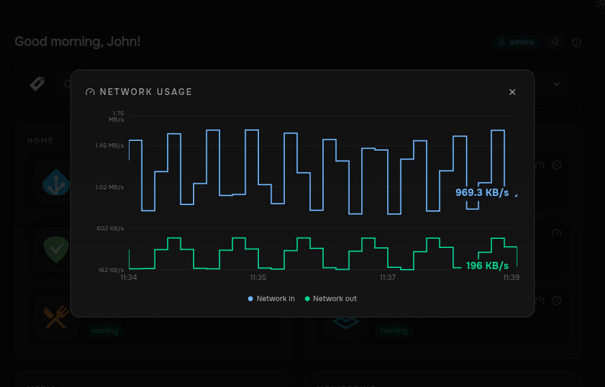

Metrics are optional. Dashmark can show Docker CPU, memory, and network usage for Docker-backed cards, plus metrics from supported service APIs.

Browse the [metrics catalogue](https://github.com/edmogeor/dashmark/blob/main/metrics/LIBRARY.md) for supported services, available metrics, inputs, and credentials.

## Metric types

| Type | Best for | Configuration |
| --- | --- | --- |
| Container metrics | CPU, memory, and network usage for a Docker container. | Docker labels or YAML. |
| Library metrics | Values from a supported service API. | Docker labels or YAML. |
| Custom metrics | Values from an API not covered by the library. | YAML. |

Standalone YAML cards support library and custom metrics, but not container metrics.

## Configure card metrics

Docker-backed cards show CPU, memory, and network usage out of the box. Set `SHOW_METRICS=false` to disable metrics dashboard-wide.

When a card specifies metrics, it shows exactly the entries listed. The built-in resource entries are `cpu`, `memory`, and `network`; library entries use `provider/metric` keys; other entries are custom metrics.

```yaml
labels:
  dashmark.metrics: cpu,memory,radarr/queue
```

```yaml
radarr:
  metrics:
    entries:
      cpu: {}
      memory: {}
      radarr/queue: {}
```

Omit `cpu`, `memory`, and `network` to show only library or custom metrics.

To disable all metrics for one card, use `none`:

```yaml
labels:
  dashmark.metrics: none
```

```yaml
radarr:
  metrics: none
```

Dashmark collects metrics every 10 seconds by default. Set `METRICS_DATABASE_PATH` to a mounted path such as `/data/metrics.db` to retain metric history when the Dashmark container is replaced.



Select a metric from a card's metrics panel to open its full history chart. Network usage displays inbound and outbound traffic together.

```yaml
services:
  dashmark:
    volumes:
      - ./data:/data
    environment:
      - METRICS_DATABASE_PATH=/data/metrics.db
```

## Next steps

- [Library metrics](/dashmark/docs/metrics/library/) for supported services.
- [Custom metrics](/dashmark/docs/metrics/custom/) for your own HTTP APIs.
- [Access control](/dashmark/docs/configuration/access-control/) to restrict metric data for specific users.
